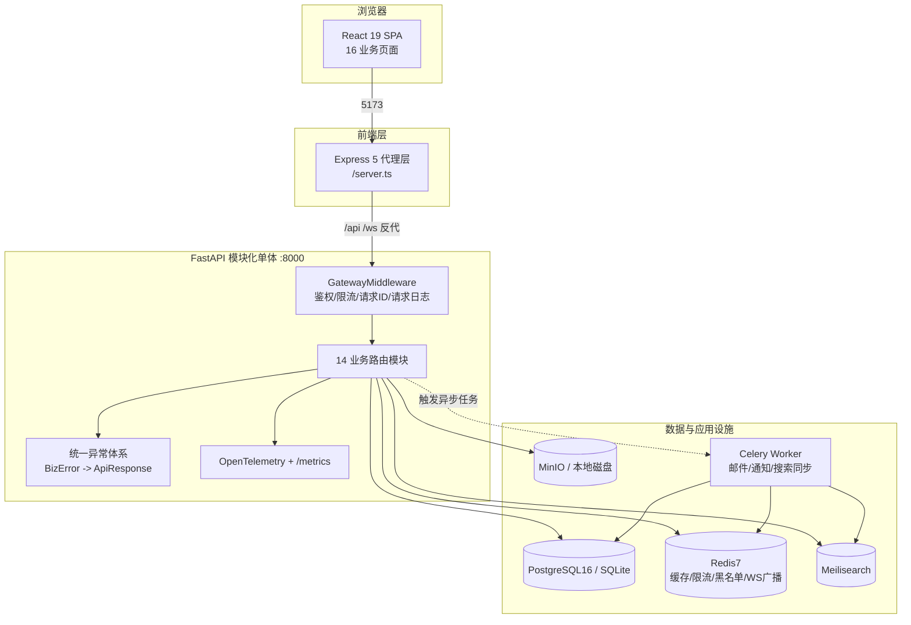
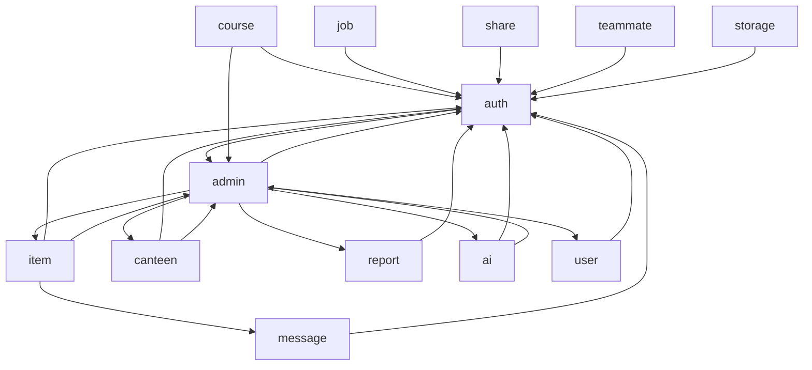
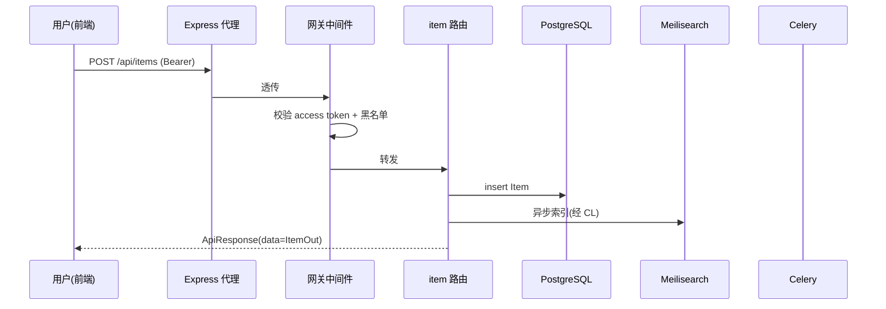
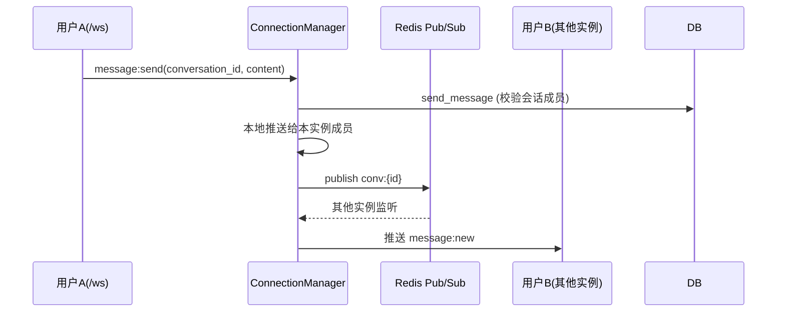
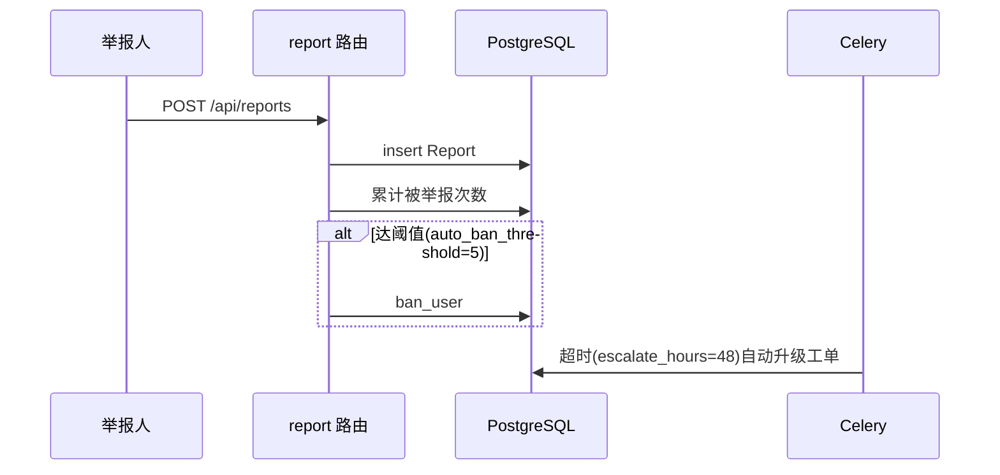

# CampusSphere 架构梳理与依赖分析

> 主理人：齐活林（软件团队） · 架构师：高见远
> 分析日期：2026-08-28 · 代码基：本地 `main` 分支
> 数据来源：直接阅读 `backend/app/**`、`frontend/**`、`config/**`、`deploy/**`、`docs/**`，并与 README 交叉验证。

---

## 1. 功能定位

**一句话**：CampusSphere 是一站式「校园生活平台」——用一套可配置的模块化单体，覆盖二手交易、课程评价、食堂、兼职、分享、组队、即时消息、举报与管理后台，并内置可选的 Gemini AI 助手，目标是通过「一份代码 + 一份 `config/school.yaml`」实现「一所学校一键上线」的多校 SaaS 化交付。

**业务域边界**（14 个后端模块）：账号体系（auth/user）、内容交易（item/share/teammate/job）、信息服务（course/canteen）、社交（message）、治理（report/admin）、平台能力（ai/storage/launcher）。

**目标用户**：在校大学生（C 端）+ 学校运营管理员（B 端 `/admin`）。

---

## 2. 整体架构

采用 **FastAPI 模块化单体（Modular Monolith）**：所有业务模块进程内运行，通过应用工厂统一装配；跨模块以 `import` 方式复用 service，而非 RPC。配置与多校差异通过 `school.yaml` 注入，基础设施（DB/Redis/MinIO/Meili）以接口抽象并支持「无外部组件降级」。

**关键架构决策**：
- **模块化单体而非微服务**：降低部署复杂度，适合「单校一实例」起步；用 `core/`/`common/` 作为共享内核，业务模块只依赖内核与彼此的 service。
- **多校配置机制**：`core/config.py` 加载顺序 = `.env` → `school.yaml` 覆盖/补充。`school.yaml` 提供 `oauth/minio/meilisearch/report_policy/auth/items/courses/ai/admin` 嵌套字段；`.env` 中的 `MINIO_*`/`MEILI_*` 优先于 yaml（最具体来源胜出）。`get_settings()` 用 `lru_cache` 做成进程单例。
- **零外部依赖降级**：Redis、MinIO、Meilisearch、SMTP 任一缺失均回落到内存/本地磁盘/内置兜底，保证本地用 SQLite 即可 `uvicorn` 起全栈。
- **网关隐藏**：`/api/admin/*`（除 discover）未带 `X-Admin-Gateway` 令牌一律返回 404，避免被探测。

---

## 3. 技术栈清单（实际版本，取自 `pyproject.toml` / `package.json` / `docker-compose.yml`）

### 前端
| 类别 | 组件 | 版本 | 用途 |
|---|---|---|---|
| 框架 | react / react-dom | ^19.2.3 | UI |
| 路由 | react-router-dom | ^7.12.0 | 前端路由 |
| 构建 | vite | ^6.2.0 | 打包 |
| 代理 | express / http-proxy-middleware | ^5.2.1 / ^4.2.0 | 开发期 `/api`、`/ws` 反代 |
| 运行 | tsx / esbuild | ^4.23.12 / ^0.28.2 | `server.ts` 运行与打包 |
| 样式 | tailwindcss | ^3.4.19 | 原子化 CSS |
| AI | @google/genai | ^1.37.0 | 前端 AI 状态查询（密钥不落前端） |
| 图表 | recharts | ^3.6.0 | 管理后台看板 |
| 类型 | typescript | ~5.8.2 | 类型检查 |

### 后端
| 类别 | 组件 | 版本 | 用途 |
|---|---|---|---|
| Web | fastapi / uvicorn[standard] | >=0.111 / >=0.30 | 应用与 ASGI 服务器 |
| ORM | sqlalchemy / asyncpg / aiosqlite | >=2.0.30 / >=0.29 / >=0.20 | 异步数据层（PG/SQLite） |
| 迁移 | alembic | >=1.13 | 生产库迁移 |
| 校验 | pydantic / pydantic-settings | >=2.7 / >=2.3 | 模型与配置 |
| 缓存/队列 | redis / celery | >=5.0 / >=5.4 | 缓存、限流、黑名单、异步任务 |
| 安全 | pyjwt / passlib[bcrypt] / bcrypt / cryptography | >=2.8 / >=1.7 / >=4.1 / >=42 | JWT、密码哈希 |
| 存储 | minio | >=7.2 | S3 兼容对象存储 |
| 搜索 | meilisearch | >=0.32 | 全文检索 |
| 可观测 | prometheus-client / opentelemetry-* / structlog | >=0.20 / >=1.25 / >=24.1 | 指标、追踪、结构化日志 |
| 其他 | httpx / pyyaml | >=0.27 / >=6.0 | OAuth HTTP 调用、YAML 配置 |

### 基础设施（docker-compose）
| 组件 | 镜像/版本 | 备注 |
|---|---|---|
| PostgreSQL | postgres:16 | 生产库 |
| Redis | redis:7 | 缓存/队列/广播 |
| MinIO | minio/minio:latest | 对象存储（**latest 标签不稳定**） |
| Meilisearch | getmeili/meilisearch:v1.11 | 搜索 |
| Nginx | nginx:1.25 | 反向代理 + 静态托管 |

### 可观测
- OpenTelemetry（OTLP）注入 FastAPI；`/metrics` 暴露 Prometheus 指标。
- structlog → JSON stdout，容器化采集。

---

## 4. 核心模块剖析

模块路径 `backend/app/modules/*`，统计自实际 `.py` 行数（含 router/service/model/schema）。

| 模块 | 职责 | LOC | 主要依赖（跨模块） |
|---|---|---|---|
| **auth** | 注册/登录/绑定/双 Token/验证码/OAuth | 1053 | admin（↔ 循环） |
| **user** | 用户资料、个人中心 | 243 | auth |
| **admin** | 管理后台：看板/举报处理/审核配置/邮箱规则/AI 配置/种子账号 | 1129 | item, canteen, report, ai, user, auth（↔ 循环） |
| **item** | 二手市场：发布/浏览/详情/审核/交易 | 466 | auth, admin, message |
| **message** | WebSocket 私信、会话、断线补偿 | 622 | auth, item |
| **course** | 课程搜索/详情/评价 | 234 | auth, admin |
| **canteen** | 食堂/档口/菜品/评价 | 344 | auth, admin |
| **job** | 兼职发布/申请状态机 | 220 | auth |
| **share** | 分享圈动态/评论 | 147 | auth |
| **teammate** | 组队发帖/入队/队伍状态 | 206 | auth |
| **report** | 多目标举报/自动封禁/工单升级 | 224 | auth, admin |
| **ai** | Gemini 智能助手（灵感/润色/摘要/分类） | 427 | auth, admin |
| **storage** | 对象存储上传/签名 URL/清理 | 107 | auth |
| **launcher** | OpenTelemetry 初始化、生命周期 | 96 | — |

**共享内核**：
- `core/`：`config`(配置单例+校验)、`database`(引擎/会话/SQLite 列迁移)、`redis`(连接池+内存兜底)、`security`(bcrypt/JWT/黑名单)、`response`(统一响应)、`exceptions`(BizError+全局 handler)、`logging`(structlog)、`middleware`(网关)、`storage`(MinIO/本地降级)。
- `common/`：`models`(Base/基类等)、`enums`、`utils`。

---

## 5. 模块依赖关系

### 5.1 依赖图（箭头 = 依赖方向）

（其余模块 `share/teammate/job/report/launcher/storage` 仅依赖 `core`/`common` 与 `auth`，未画出自环。）

### 5.2 共享内核依赖
所有 14 个业务模块均依赖 `core` 与 `common`（配置、数据库会话、安全、日志、响应）。`auth` 与 `admin` 是事实上的「二级共享内核」——约 **10 个模块**依赖 `auth`；`admin` 反向依赖 `auth` 且被 `auth/item/ai/course` 依赖。

### 5.3 ⚠️ 架构问题（依赖视角）
1. **auth ↔ admin 循环依赖**（高）：`auth/router.py` 顶层 import `admin`，`admin/router.py` 顶层 import `auth`（各 3 / 1 处）。当前未崩是因部分 import 在函数内惰性执行，但属「定时炸弹」，任何改为顶层 import 即 ImportError。
2. **admin 模块过重**（中）：1129 LOC、依赖 6 个其他模块，违反「单一职责」，应拆分为 `admin_auth`/`admin_content`/`admin_dashboard` 等子域。
3. **跨模块直接 import service**（中）：如 `item` 直接 `import message.service`、`course` 直接 `import admin.service`。模块化单体下可接受，但缺乏明确的「领域门面」，未来拆微服务成本高。
4. **ai 模块被前端与 admin 双向依赖但自身无独立限界**（低）：AI 能力散落在 router，缺少 `ai/client` 抽象（便于切换模型/厂商）。

---

## 6. 数据流与调用链

### 6.1 用户发布二手物品

### 6.2 WebSocket 私信发送（含跨实例广播）

> 断线补偿：重连时带 `since` 参数，`_compensate()` 回查 `Message.created_at > since` 增量补推（限 100 条）。无 Redis 时降级为单实例内存直发。

### 6.3 举报工单升级 / 自动封禁

---

## 7. 架构层面问题清单（汇总，详见 02/03 报告）

| 严重度 | 问题 | 位置 |
|---|---|---|
| 高 | auth↔admin 循环依赖 | auth/router.py, admin/router.py |
| 中 | admin 模块职责过重（1129 LOC） | backend/app/modules/admin |
| 中 | 跨模块直接 import service，缺少领域门面 | 多处 |
| 中 | 生产库强依赖 `create_all`（alembic 仅 1 个基线迁移），模型演进无增量迁移 | alembic/versions |
| 低 | ai 模块缺 client 抽象 | backend/app/modules/ai |
| 低 | 配置 `extra="allow"` 放开任意环境变量 | core/config.py:32 |

---

## 8. 与文档的交叉验证
- README 声称「73 个接口」：`openapi.json` 实际含 **73+** 个 path（以运行期 `/openapi.json` 为准，启动验证阶段复核）。
- README 声称「Gemini 无 Key 降级内置文案」：实际 `ai` 模块在 `ai.feature.enabled=false` 时由前端隐藏入口、后端抛错，**已移除内置假文案**（与 README 早期描述略有出入，属正向改进）。
- README「零外部依赖启动」：经验证成立（Redis/MinIO/Meili 缺失均降级）。
