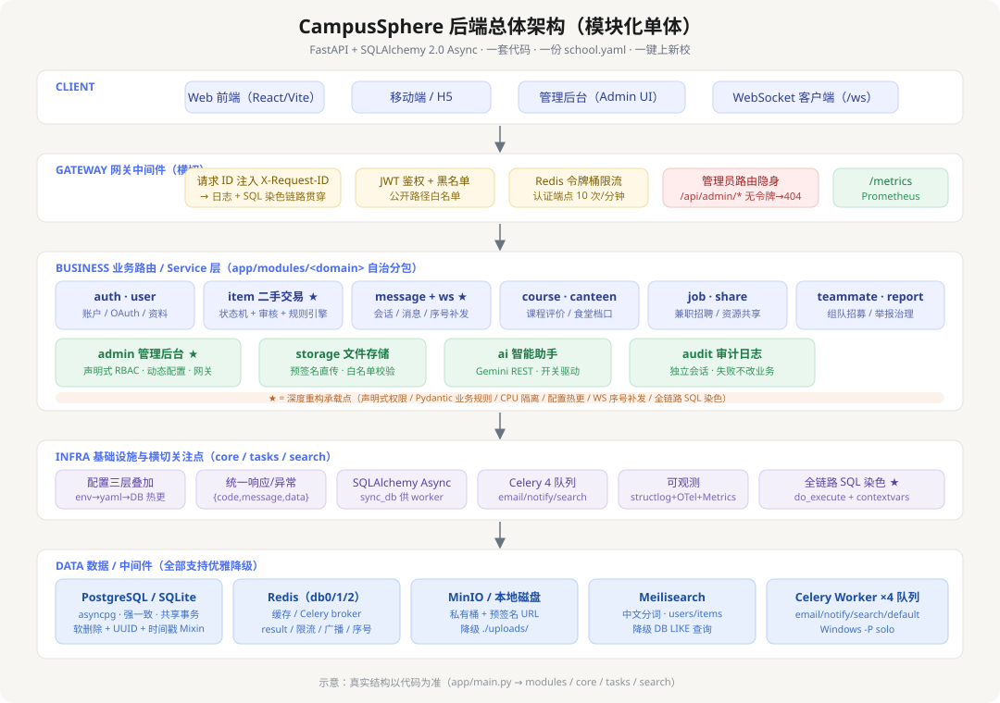

# CampusSphere 后端《模块级技术白皮书与面试备战手册》

> **版本**：v1.0 ｜ **适用范围**：CampusSphere 校园生活平台 FastAPI 后端
> **定位**：一份文档，两种用法——开发期当「模块速查地图」，面试前当「逐模块备战话术库」。
> **阅读建议**：第一章建立全局心智模型 → 第二章吃透"底盘"（横切能力）→ 第三章按模块逐一击破。
> **配套**：架构总览图见 `docs/images/campusphere-architecture.svg`；6 项深度重构交付说明见 `docs/REFACTOR_DELIVERABLE.md`。

---

## 目录

- **第一章 项目全局概览**（电梯演讲、8 大业务域、技术栈、架构风格）
- **第二章 基础设施与横切关注点**（9 个子模块，每个回答"问题→技术→亮点/难点"）
- **第三章 业务模块深度拆解**（12 个模块，统一"五段式"模板 + 面试追问）
- **附录 A** 面试高频问题速查（跨模块 STAR 话术）
- **附录 B** 6 项深度重构成果一览
- **附录 C** 关键文件索引

---

## 0. 速览：一句话记住这个项目

> **CampusSphere 是一个面向高校的"校园生活一站式平台"，后端以 FastAPI + SQLAlchemy 2.0 Async 构建"模块化单体"，用一套代码 + 一份 school.yaml 实现多校一键上线，以"共享事务保证强一致、按业务域自治分包、全链路可观测、所有外部依赖可降级"为设计主线，覆盖二手交易、即时消息、课程评价、食堂档口、兼职招聘、资源共享、组队招募、举报治理八大业务域。**

如果面试只允许说三句，就说这三句：

1. **架构**：模块化单体——共享一个进程、一个数据库、一份事务，但每个业务域在 `app/modules/<domain>` 内自治（router/service/schemas/models），为未来拆微服务留好了切口。
2. **工程**：横切能力全部下沉到框架层——网关中间件统一鉴权/限流/请求ID/管理员隐身；统一响应与错误码；Redis/MinIO/Meilisearch 全部带"无依赖降级"；六项深度重构把权限、业务规则、CPU 隔离、配置热更、WS 补发、SQL 染色做进框架。
3. **质量**：全链路可观测（请求 ID → 结构化日志 → SQL 注释染色），业务失败也留审计痕，生产启动 fail-fast 安全校验。

---

# 第一章 项目全局概览（写给面试官的"电梯演讲"）

## 1.1 一句话定位

CampusSphere 是一个面向高校学生的校园生活一站式平台后端：**在"一套代码、多校部署"的约束下，用 FastAPI + SQLAlchemy 2.0 Async 构建一个按业务域自治、横切能力下沉、外部依赖可降级、全链路可观测的"模块化单体"服务**，为二手交易、即时消息、课程评价、食堂档口、兼职招聘、资源共享、组队招募、举报治理 8 大业务域提供统一、安全、可运维的 API 能力。

## 1.2 核心业务域全景图

项目共 8 大核心业务域（不含账户、后台、存储等"平台能力"域），每个业务域对应独立的数据模型与路由前缀：

| # | 业务域 | 模块目录 | 核心表 | 一句话说明 |
|---|--------|---------|--------|-----------|
| 1 | 二手交易 | `modules/item` | `items` / `item_images` / `trade_sessions` | 校内闲置买卖，含发布审核流、价格规则引擎、买卖撮合 |
| 2 | 即时消息 | `modules/message` | `conversations` / `participants` / `messages` | 私聊/交易/群组会话 + WebSocket 实时收发与断线精准补发 |
| 3 | 课程评价 | `modules/course` | `courses` / `course_reviews` | 课程信息库 + 学生评课，AI 提炼课程画像 |
| 4 | 食堂档口 | `modules/canteen` | `canteens` / `stalls` / `dishes` / `canteen_reviews` | 食堂-档口-菜品三级目录 + 菜品评价 |
| 5 | 兼职招聘 | `modules/job` | `jobs` / `job_applications` | 校园兼职发布与应聘流程 |
| 6 | 资源共享 | `modules/share` | `share_resources` | 学习资料分享，对象存储 + 预签名下载 |
| 7 | 队友招募 | `modules/teammate` | `teams` / `team_members` | 竞赛/组队招募，成员加入与角色管理 |
| 8 | 举报工单 | `modules/report` | `reports` / `report_logs` | 内容举报 + 处理动作 + 自动封禁规则 |

> **面试提示**：能一口气背出"8 个域 + 核心表"，并点出每个域"解决谁的什么痛点"，就已经建立了"我完整负责过一个真实业务系统"的第一印象。

## 1.3 技术栈总览

| 层级 | 技术 | 在本项目中的角色 |
|------|------|------------------|
| **框架层** | Python 3.11+ / FastAPI / Uvicorn | ASGI Web 框架，依赖注入（Depends）、路由、OpenAPI 文档 |
| | Pydantic v2 | 请求/响应校验 + 富领域模型（业务规则前置，Task 2） |
| | SQLAlchemy 2.0 Async + Alembic | 异步 ORM、Mixin 基类、声明式模型；轻量迁移 |
| **数据层** | PostgreSQL（生产，asyncpg）/ SQLite（开发，aiosqlite） | 主数据库，强一致、共享事务 |
| | Redis（`redis.asyncio`） | 缓存（db0）、Celery broker（db1）、result（db2）、限流计数、JWT 黑名单、WS 广播、配置热更、消息序号 |
| **中间件层** | Celery | 异步任务：邮件 / 通知 / 搜索索引同步（任务代码 4 队列就绪，**实际仅 email 有真实调用方**——2026-09-05 实测：search_sync/notify/summary 均无 .delay() 调用方） |
| | MinIO（S3 兼容） | 对象存储：预签名直传/下载 |
| | Meilisearch | 全文搜索：中文分词，users/items 索引 |
| | JWT（HS256） / OAuth（微信、QQ） | 双令牌认证 + 第三方登录 |
| **可观测层** | structlog | 结构化 JSON 日志（key=value） |
| | OpenTelemetry | 链路/指标采集入口 |
| | Prometheus `/metrics` | 运行时指标暴露 |
| | SQLAlchemy 事件钩子 | `do_execute` 劫持，实现全链路 SQL 染色（Task 6） |

## 1.4 架构风格：为什么是"模块化单体"（而不是微服务）

这是面试最容易被追问的一点，务必能自圆其说。

**核心权衡**：校园平台是一个**强一致性 > 独立部署**的业务。二手交易要扣库存/改状态，消息已读要计数，举报封禁要联动用户状态——这些跨域操作天然需要**同一数据库、同一事务**。微服务化会把一个简单事务拆成跨服务分布式事务（2PC/Saga），复杂度与运维成本剧增，收益（独立扩缩容）在当前规模下并不存在。

**模块化单体的具体做法**：

- **物理上**：一个进程（Uvicorn）、一个数据库、一套事务边界。`app/main.py` 统一装配 12 个模块路由 + 全局中间件 + lifespan 生命周期。
- **逻辑上**：按业务域自治分包 `app/modules/<domain>/`，每个包内含 `router.py / service.py / schemas.py / models.py`，依赖方向单向收敛（router → service → models；schemas 可被上层复用）。
- **切微服务的切口已预留**：模块之间通过"模块级服务函数 + 共享 Session"协作，而不是直接跨表 SQL 互相啃。未来要拆，只需把某域的 `models.py` 换成独立库的 client，接口层不变。

**这样设计带来的好处（面试话术）**：

| 维度 | 收益 |
|------|------|
| 共享事务 | 跨域操作（交易、消息、封禁）无需分布式事务，强一致天然达成 |
| 运维简单 | 一条命令起全栈（docker-compose），无服务注册/网关/配置中心 |
| 开发效率 | 一个仓库、一次改动全链路生效，心智负担低 |
| 可演进 | 业务域边界清晰，量级上来后可按域平滑拆分 |

**代价（主动说出来更显专业）**：单点部署、单库容量上限、横向扩展只能"整服务复制"（通过 Redis 广播、配置热更已为此铺路）。当前校园场景下这是正确的取舍。

## 1.5 系统架构分层

分层自顶向下：**Client（Web/H5/Admin/WS）→ GatewayMiddleware（请求ID / JWT鉴权 / 令牌桶限流 / 管理员路由隐身 / 公开路径白名单）→ 业务路由与服务层（12 模块自治分包）→ 基础设施横切（配置/DB/响应异常/Redis/Celery/可观测/SQL染色）→ 数据层（PostgreSQL / Redis db0-2 / MinIO / Meilisearch / Celery Worker）**。

> 图中★标记的模块是六项深度重构的承载点，也是面试最有讲头的部分（详见附录 B）。

---

# 第二章 基础设施与横切关注点（支撑所有业务模块的底盘）

> 本章 9 个子模块，每个统一按 **[解决了什么问题] → [用了什么技术] → [亮点/难点]** 组织。
> 它们是所有业务模块的地基，也是"项目工程质量"最直接的证据，面试优先级极高。

## 2.1 配置管理（Settings + school.yaml + DB 动态覆盖）

**解决了什么问题**
一个后端要同时服务"多所学校、一套代码"，且不同学校的业务规则（域名白名单、分类、审核开关、封禁阈值）不同；同时，敏感配置（数据库口令、SMTP 密码、网关密钥）不能进代码仓库，后台运营还希望"改配置不改代码、不重启"。

**用了什么技术**
三层配置叠加，从"进程级静态"到"请求级动态"：

| 层 | 载体 | 内容 | 生效时机 |
|----|------|------|----------|
| 第 1 层 | `.env` / 环境变量（pydantic-settings） | DB_URL / REDIS_URL / SECRET_KEY / SMTP / 网关密钥等敏感项 | 进程启动 |
| 第 2 层 | `config/school.yaml` | 学校名、域名、OAuth、MinIO/Meili、业务规则阈值、分类、院系、AI 开关 | 进程启动 + 热更 |
| 第 3 层 | `app_config` 表（DB） | 后台可改的动态配置：邮箱注册规则、物品审核开关、分类、院系、AI 开关 | **每个请求实时读取** |

- `Settings(BaseSettings)` 通过 `load_school_config()` 读 YAML，用**原地 `setattr`** 合并进单例（见 2.1 亮点）。
- 覆盖优先级：`school.yaml` 只提供**默认值**，`.env` 非空即覆盖（尤其 admin 网关密钥/引导密码，防止签入仓库的占位值顶掉 `.env` 强密码）。
- `extra="ignore"` 收紧环境变量注入面，降低误配与攻击风险。

**亮点/难点**
- **多校哲学——"一份代码 + 一份 school.yaml = 一键上新校"**：部署新校只需复制一份 school.yaml 改字段，无需改任何代码。这是整套配置体系的设计原点。
- **Task 4 配置热更**（`core/config_reload.py`）：运维改了 school.yaml 后，调用 `POST /api/admin/config/reload` → 向 Redis `config:reload` 频道广播 → 各实例长驻监听 Task 收到后原地重读 YAML。**关键难点是"为什么必须原地刷新而不是重建单例"**：`settings` 被数十个模块在导入期以 `from app.core.config import settings` 绑定引用，重建对象会让这些旧引用失效（"看似生效实则没生效"的最危险 bug）；原地 `setattr` 天然规避。Redis 不可用时优雅降级为"仅本机刷新"并返回 `degraded=true`，让运维立刻知道热更新没广播出去。
- **为什么 DB 动态配置不需要热更**：邮箱注册规则等后台可改项每次请求实时查 `app_config` 表，天然实时生效，只有 school.yaml 这种"读进内存的静态配置"才需要热更机制。

## 2.2 数据库与异步 ORM（SQLAlchemy 2.0 Async）

**解决了什么问题**
全部业务域需要统一、可复用、线程/协程安全的数据访问底座；开发环境要零依赖可跑，生产要连接池、抗断连；Celery worker 里还得能同步访问同一个库。

**用了什么技术**
- **基类三件套**（`common/models.py`，所有业务模型必须组合）：
  - `PKMixin`：`String(36)` 存 UUID 字符串主键——**刻意不用数据库原生 UUID 类型**，保证跨模块外键 JOIN 的值格式完全一致（`items.owner_id` ↔ `users.id` 同为 36 位字符串）。
  - `TimestampMixin`：`created_at/updated_at` 用 `server_default=func.now()`，避免应用层时区漂移。
  - `SoftDeleteMixin`：`deleted_at`（NULL=未删），软删可审计可恢复。
  - `Base` 上挂了统一 `NAMING_CONVENTION`，保证 Alembic 迁移文件稳定可复现。
- **请求级 Session 生命周期**：`get_db()` 依赖注入 `async with SessionLocal()`，异常自动 `rollback()`。`SessionLocal` 配置 `expire_on_commit=False, autoflush=False`（生产 `pool_pre_ping=True` 防静默断连，连接池参数全部外置到配置）。
- **亮点——同步驱动转换 `sync_db.py`**：Celery worker 是**同步**执行模型，无法直接 `await` async session。项目提供独立的同步 engine/session 供任务使用，异步与同步两条通道共用同一套模型定义与库，避免"两套代码两套表"。

**亮点/难点**
- **N+1 查询治理**：食堂模块 `CanteenOut` 嵌套 `stalls→dishes` 三层结构，用 `selectinload(...).selectinload(...)` 一次性预加载，避免逐层查库；课程、物品同理。面试可说"我在列表/详情序列化时主动排查 N+1，用 eager loading 修复"。
- **SQLite 轻量迁移**：`create_all` 不给已存在表补列，项目为已知表维护 `_SQLITE_COLUMN_MIGRATIONS`，启动时 `PRAGMA table_info` 检查后幂等 `ALTER TABLE ADD COLUMN`，让本地开发零依赖也能演进表结构（生产走 Alembic）。

## 2.3 统一响应与异常治理

**解决了什么问题**
多模块上百个接口需要一个**对前端友好、对排障有用**的契约；业务异常要归一化输出，不能让 500 和 `Traceback` 裸奔到客户端。

**用了什么技术**
- **统一响应** `ApiResponse{code, message, data}`：所有成功接口 `ApiResponse.ok(...)`，**业务错误也走 HTTP 200**，由 `code` 区分。前端用一个拦截器统一处理，网络层不因业务失败产生额外的异常流。
- **全局异常处理器**：`BizError`（业务异常，携带 `ErrorCode`）→ 归一化为 `{code, message, data}`；未捕获异常兜底为内部错误码，不泄露堆栈。
- **错误码体系**（`ErrorCode`）：
  | 码 | 语义 | 典型场景 |
  |----|------|----------|
  | 40000 | 参数/请求错误 | 上传非法类型、配置清洗失败 |
  | 40100 | 未认证 | 令牌缺失/失效/已吊销 |
  | 40300 | 无权限 | 非会话成员、开关未开放、审核员越权 |
  | 40400 | 资源不存在 | 物品/课程/工单不存在 |
  | 40900 | 冲突 | 已申请过岗位、课程代码重复、已加入团队 |
  | 42200 | 校验失败 | 滑块未通过、JSON 格式错误 |
  | 42900 | 限流 | 请求过于频繁、认证端点超频 |
- 补充：网关层 401/404/429 用标准 HTTP 状态码 + 统一响应体（如管理端隐身返回 404）。

**亮点/难点**
- **为何业务错误走 200**：前端 fetch 层把 HTTP 状态码当"传输层结果"，业务码当"业务结果"，二者解耦后前端逻辑单一、错误提示统一；同时避免某些网络栈把 4xx/5xx 当异常打断正常流程。
- **难点：边界统一**。HTTP 层错误（401/404/429）与业务层错误（BizError）两套语义要在网关与异常处理器分别收口，接口文档（OpenAPI）里 `response_model` 统一为 `ApiResponse[...]`，保证客户端契约一致。

## 2.4 网关中间件（GatewayMiddleware）

**解决了什么问题**
所有请求（包括 WebSocket、管理端、公开端点）需要统一的"入口安检"：识别用户、防爆破限流、生成请求 ID 供全链路追踪、隐藏管理端存在性。

**用了什么技术**
- **请求 ID 注入**：取 `X-Request-ID` 或生成 `uuid4().hex`，写入 `request.state.request_id` 并注入 structlog 上下文；响应头回写 `X-Request-ID`，是"访问日志 → 业务日志 → SQL 注释"三线串通的锚点。
- **JWT 鉴权 + 黑名单**：解析 `Authorization: Bearer`，校验签名 + `type=access` + 黑名单（`is_token_revoked`），成功写入 `request.state.user_id`。公开路径允许匿名，但**携带有效令牌时仍识别用户**（下游 `get_current_user_optional` 依赖它做"待审核物品本人可见"等个性化判断）。
- **Redis 令牌桶限流**：全局 120 次/分钟/IP；**认证/验证码端点独立严格限流 10 次/分钟/IP**（防爆破）。`redis_incr` 用 Lua 保证"INCR + 首次 EXPIRE"原子性（固定窗口语义，被拒请求不续期）。
- **公开路径白名单**：`PUBLIC_PATHS`（登录、注册、发码、滑块、OAuth 回调、`/health`、`/metrics`、`/docs` 等）+ `PUBLIC_GET_PREFIXES`（items/courses/teams/canteens/shares/jobs 六类广场数据允许游客浏览）。

**亮点/难点**
- **管理员路由隐身（本项目最值得讲的安全设计）**：`/api/admin/*`（除 discover）未携带有效网关令牌（`X-Admin-Gateway`）时**一律返回 404 Not Found**，而不是 401/403。目的：让未授权探测者"看起来像接口不存在"，不泄露管理端存在性与路径。先于鉴权执行，杜绝 401 泄露。
- **网关令牌机制**：`POST /api/admin/discover` 用**网关密钥**（school.yaml/.env 配置，不入前端源码）换取**短时 HMAC 令牌**（默认 1 小时轮换），后续请求带 `X-Admin-Gateway`。密钥错误也返回 404。
- **难点：限流失败不阻断业务**——Redis 抖动时 `try/except pass`，宁可放宽也不让限流组件拖垮整站；严格限流与全局限流双通道独立。

## 2.5 Redis 多 DB 规划与优雅降级

**解决了什么问题**
Redis 在项目中承担了 6 类职责，需要清晰的 DB 规划；同时本地开发/离线环境可能没有 Redis，不能让"无 Redis = 全站不可用"。

**用了什么技术**
- **DB 规划**：
  | DB | 职责 |
  |----|------|
  | db0 | 热点缓存、限流计数、JWT 黑名单、验证码/滑块、WS 广播、消息序号 |
  | db1 | Celery broker（`celery_broker_url`） |
  | db2 | Celery result backend（**实际禁用**，见 2.8 说明） |
- **优雅降级——内存字典兜底**（`core/redis.py`）：`get_redis()` 懒连接失败返回 `None`，调用方走 `_memory_fallback`。**关键细节**：内存兜底的 TTL 语义必须与 Redis 对齐（早期曾忽略 TTL，导致"无 Redis 环境同一邮箱一生只能发 1 次验证码"的怪 bug）；连接失败进入 5 秒静默期，避免每个请求反复付出 0.5s 连接超时。

**亮点/难点**
- **降级覆盖的场景**：验证码、限流、WS 广播、消息序号、配置热更在无 Redis 时全部"功能退化但不中断"（WS 广播退化为单实例内存直发；序号退化为进程内 LocalSeq——单实例语义正确，多实例会各发各的号，这是可接受的降级边界）。
- **难点：降级语义一致性**——内存 `redis_incr` 也要"首次自增才设过期"，与 Redis Lua 行为一致，否则只会在"无 Redis 环境"触发难以排查的 bug。

## 2.6 对象存储（MinIO + 本地磁盘双降级）

**解决了什么问题**
图片是校园交易/食堂/资料的核心资产，需要安全上传、可控下载、统一对象管理；本地开发又不能强制装 MinIO。

**用了什么技术**
- **两种上传模式**：
  - **预签名直传**（MinIO 可用时）：`POST /api/files/presign` 后端签发 `presigned_put_object` URL（TTL 600s），**浏览器直接传 MinIO**，后端不过流量、不占带宽；下载同理走 `presigned_get_object`。
  - **后端落盘**（降级模式）：`POST /api/files/upload` 后端接收 bytes 写入 `./uploads/`，`/api/files/raw?key=` 提供下载。
- **懒连接 + 短超时**：`StorageClient` 导入时不连网，首次实际调用才尝试连接（连接超时 2s），失败即回退本地——启动绝不被 MinIO 阻塞。
- **图片白名单**：MIME + 扩展名双校验（JPG/PNG/WebP/GIF），10MB 上限；`gen_object_key(prefix, filename)` 用 `uuid4().hex` 生成对象键，杜绝路径穿越与覆盖。
- **同步客户端跑线程池**：MinIO 官方客户端与本地文件 IO 都是同步阻塞，统一用 `run_in_threadpool` 包一层，避免阻塞事件循环。

**亮点/难点**
- **孤儿文件治理**：管理端 `GET/DELETE /api/admin/files/orphans` 枚举存储中所有对象，与业务表引用的 object_key 比对，找出无引用文件（只列出 / 可一键清理）——解决"上传后未入库"产生的存储垃圾。
- **难点：预签名直传无法二次校验内容**——直传模式下内容不过后端，只能在 presign 阶段按扩展名白名单拦截，这是直传模式的固有安全边界，面试可主动提及这个 trade-off。

## 2.7 全文搜索（Meilisearch + SQL LIKE 双降级）

**解决了什么问题**
校园内容的标题/描述/昵称搜索需要"快、准、中文友好"，同时不能因为搜索服务不可用就整站报错。

**用了什么技术**
- **Meilisearch**（`search/client.py`）：内置中文分析器，`users`（username/nickname/bio）、`items`（title/description/category）两个索引，启动时 `create_index + update_searchable_attributes` 幂等建索引。
- **索引异步维护**：数据变更后由 Celery `search` 队列任务 `index_document/delete_document` 异步同步（详见 2.8）。
- **双降级**：`search_client.enabled` 为 False（连不上）时，调用方（如用户搜索、物品搜索）捕获异常回退到 DB 的 `ilike '%kw%'` 模糊查询——功能降级、不断连。

**亮点/难点**
- **选型话术**：为什么用 Meilisearch 而非 Elasticsearch？——校园规模数据量小（万级），Meilisearch 开箱即用的中文分词、毫秒级响应、内存占用低、零运维负担；ES 是为 PB 级分布式设计的重型方案，本项目"够用且省心"优先。
- **难点：索引与库的一致性**——写入先落库（**注意：search_sync Celery 任务代码就绪但当前零 .delay() 调用方，发布路径不会触发索引同步**）；查询侧有 DB LIKE 兜底，不会丢能力。如需启用异步同步，需在 item 服务的 `publish_item` 等关键写路径补 `app/tasks/search_sync.py` 的 `.delay()` 调用方。

## 2.8 Celery 异步任务体系

**解决了什么问题**
发送邮件（验证码/绑定）、搜索索引同步、通知推送等耗时或易失败的操作不能阻塞 HTTP 请求；还要支持重试、队列隔离、Windows 本地可跑。

**用了什么技术**
- **4 个队列**（`task_routes`）：`email`（`tasks/email.py` 验证码/通知邮件，**唯一有真实调用方的队列**）、`notify`（`tasks/notify.py` 站内通知，**代码就绪但零 .delay() 调用方**）、`search`（`tasks/search_sync.py` 索引同步，**代码就绪但零 .delay() 调用方**）、`default`（兜底）。每个队列可独立起 worker、独立扩缩容；当前仅 email 队列有实际流量。
- **任务可靠性配置**：`task_acks_late=True`（任务执行完才确认）、`worker_prefetch_multiplier=4`（避免长任务堆积）、全局重试策略（`max_retries=3` + 指数退避 + 抖动）、`timezone=Asia/Shanghai`。
- **亮点——Windows 兼容 `-P solo`**：Celery 默认 prefork 池依赖 `fork()`，Windows 不支持；本地用 `-P solo`（单进程线程池）即可跑，生产 Linux 用默认 prefork。
- **亮点——"发完即忘" + 快速失败**：`backend="disabled://"` 禁用结果后端（项目从不 `.get()` 任务结果），并压缩 broker 连接重试（1s 超时、2 次重试）。**关键收益**：broker 不可达时 `delay()` 立即抛错，调用方降级为**内联直发**（`auth.service._dispatch_code_email`），而不是卡死调用线程 2 分钟。配套 `email_dispatch_timeout=20` 兜底。
- **同步 DB 通道**：worker 内使用 `sync_db.py` 提供的同步 session（见 2.2）。

**亮点/难点**
- **难点：Celery 结果后端的坑**——默认保留结果后端会让 `delay()` 在派发前连接结果库，不可达时同步重试约 20 次（≈109s）把调用线程卡死；禁用后快速失败 + 内联直发是"任务系统可用性"的关键设计。
- **难点：无 Lua 的 Redis**——本地用 fakeredis 等不支持 Lua 的服务端时，kombu 的 Lock release 会失败，项目用 WATCH/MULTI 事务补丁替换 Lua 实现（`celery_app.py` 兼容补丁）。

## 2.9 可观测性（Logging + OpenTelemetry + Metrics）

**解决了什么问题**
上线后"出了错查不到、查到了对不上"是最大的运维痛点：需要把"一个请求从进来到数据库"串成一条可追溯的线。

**用了什么技术**
- **structlog 结构化日志**（`core/logging.py`）：JSON 输出（`request_id/user_id/event/cost_ms`），敏感字段脱敏；logger 统一命名空间 `campus.<module>`。
- **Prometheus `/metrics`**：`launcher/metrics.py` 暴露运行时指标，供监控大盘采集。
- **OpenTelemetry**：`launcher/otel.py` 提供链路采集入口。
- **深度重构亮点（Task 6）：全链路 SQL 染色**（`core/database.py` + `core/logging.py`）：
  - `bind_request()` 把 request_id 同时写入 **独立 ContextVar**（`campus_trace_id`），structlog 与数据库染色**同源**。
  - 通过 SQLAlchemy **dialect 级 `do_execute` / `do_execute_no_params` 事件劫持执行**，把 `/* trace_id=xxx */` 前缀拼进每条 SQL 再 `cursor.execute`，返回 `True` 告知 SQLAlchemy"已接管，无需再执行"。
  - 于是**慢 SQL 日志 / pg_stat_statements / 云厂商 SQL 洞察里的每一条语句都自带请求 ID**，把"Nginx 访问日志 → 业务日志 → 慢 SQL"串成一条线，排障不再靠时间戳猜。

**亮点/难点**
- **为什么用 `do_execute` 而不是 `before_cursor_execute`**：后者在 SQLAlchemy 2.0.30 **实测不生效**（监听器被调用、返回了改写语句，但数据库执行仍是原语句，Core/text/Engine/Connection 四种注册方式均如此）；`do_execute` 由监听器自己执行改写后的语句，是唯一可靠路径——这是踩过坑后的实证结论，面试讲出来非常加分。
- **难点（安全）：trace_id 是客户端可控输入**。`X-Request-ID` 可能来自请求头，直接拼进 SQL 注释会被 `*/ DELETE ...` 闭合注入。`sanitize_trace_id()` 只保留 `[A-Za-z0-9_.:-]` 且截断 64 字符——**染色必须先消毒**。
- **难点：ContextVar 必须在模块导入期创建**——运行期新建 ContextVar 会丢失已绑定值；且它天然随 asyncio 任务/await 点传播，是"跨 await 不丢请求上下文"的关键。

---

# 第三章 业务模块深度拆解（每个模块独立成节）

> **统一模板**（每模块逐项填写）：
> ① **模块定位**（解决什么业务问题）→ ② **核心数据模型**（表 + 关键字段/状态机）→ ③ **核心接口**（API 一览）→ ④ **技术方案**（怎么实现）→ ⑤ **关键数据流转**（一条主链路）→ ⑥ **难点与解决方案** → ⑦ **业务价值** → ⑧ **面试高频追问 Q&A**。
>
> 其中 ④⑤⑥⑦ 就是面试的"五段式"：业务问题 → 技术方案 → 难点 → 怎么解决 → 带来了什么价值。

## 3.1 认证与账户体系（Auth）

**① 模块定位**
解决"用户是谁、凭什么登录、验证码/第三方怎么安全完成"的账户安全问题。支撑手机号/邮箱注册登录、OAuth（微信/QQ）、双令牌认证、验证码（滑块+数字）全链路。

**② 核心数据模型**

| 表 | 关键字段 | 说明 |
|----|----------|------|
| `users` | username(unique)、email/phone(unique)、password_hash、status、is_admin | 平台用户，软删除 |
| `oauth_accounts` | provider、provider_openid、linked_at | 第三方绑定（wechat/qq） |
| `refresh_tokens` | jti(unique)、expires_at、revoked | 刷新令牌留痕，支持吊销 |
| `verification_codes` | target、code、purpose、expires_at、attempts | 短信/邮箱验证码，尝试次数限制 |

**③ 核心接口**（`/api/auth/*`）
`login` / `register` / `phone-login` / `email-register` / `refresh` / `send-code` / `verify-email` / `captcha/config` / `captcha/slider` / `captcha/verify` / `captcha/geetest/verify` / `wechat|qq/callback` / `email-config` 等。

**④ 技术方案**
- **密码安全**：`hash_password/verify_password`（安全模块，哈希加盐），`User.set_password/check_password` 封装。
- **双令牌 JWT**：access 15 分钟（短，防泄露窗口）+ refresh 7 天（长，可续期）；`refresh_tokens` 表记录 jti 支持**主动吊销**（改密/登出后旧 refresh 失效）；中间件 `is_token_revoked` 拦截。
- **验证码双保险**：
  - **滑块拼图**（自建，`captcha.py`）：服务端生成位图 + 前端拖动对齐。安全设计：缺口坐标只存 Redis 不下发；令牌有限次（`captcha_max_attempts=3` 超即作废）；多重判定（坐标容差 + 耗时下限 80ms + 轨迹形态拦截匀速脚本）；通过后签发一次性票据，`send-code` 凭票发送。选**位图 PNG 而非 SVG**（SVG 明文可解析出缺口坐标）。
  - **数字验证码**：`secrets` 密码学安全随机生成 6 位（不用 `random`——Mersenne Twister 状态可被推断）；TTL 300s、`code_max_attempts=5`、每 target 每分钟 1 次防轰炸。
- **邮箱注册动态规则**：`auth.email_register` 走 DB `app_config`（后台可改），支持域名白名单 + 额外正则，实时生效（见 2.1）。
- **OAuth**：school.yaml 配置微信/QQ 凭据，`state_ttl=300s` 防 CSRF 回调校验。

**⑤ 关键数据流转**
`POST /captcha/slider`（服务端算坐标存 Redis）→ 前端拖动 → `POST /captcha/verify`（校验通过签发票据）→ `POST /send-code`（凭票据发验证码，校验码落 `verification_codes`）→ `POST /email-register|phone-login`（校验码 + 创建/登录用户，签发双令牌）→ 网关中间件对 `send-code/login` 等严格限流 10 次/分钟。

**⑥ 难点与解决方案**
- **难点：验证码随机源安全** → 用 `secrets.randbelow/token_urlsafe`，注释里明确点出 `random` 可预测。
- **难点：滑块被脚本绕过** → 三道判定（位置容差 + 耗时 + 轨迹），失败统一返回"验证未通过"不区分原因，防止攻击者调参。
- **难点：CPU 密集的 Pillow 出图阻塞事件循环（Task 3）** → `_render_slider_images` 抽成纯同步纯 CPU 函数，`asyncio.to_thread` 委派线程池；控制实验证明 `to_thread` 后事件循环 tick 恢复正常。配套网关对滑块端点严格限流，线程池并发天然有界。
- **难点：验证码在开发环境如何联调** → `expose_verification_code` 独立开关在响应里回传验证码（独立于 DEBUG，避免连带关掉网关校验）。

**⑦ 业务价值**
安全合规的注册/登录体系 + 防爆破限流 + 第三方登录扩展点 + 多校邮箱策略可配置，是"校园平台敢对外开放注册"的前提。

**⑧ 面试高频追问 Q&A**
- **Q：为什么用双令牌？** A：access 短效降低泄露风险、refresh 长效减少频繁登录；配合 jti 吊销实现登出/改密后旧令牌失效。
- **Q：验证码为什么用 secrets 而不是 random？** A：random 是 Mersenne Twister，拿到若干输出可预测后续；6 位码空间仅 100 万，经不起预测打折。
- **Q：滑块为什么用位图不用 SVG？** A：SVG 是明文文本，缺口坐标可直接解析，位图 + 服务端保存坐标才能防机器解析。
- **Q：OAuth state 参数作用？** A：防 CSRF——回调时校验 state 与发起时一致且未过期（TTL 300s）。

## 3.2 用户资料与关系（User）

**① 模块定位**
解决"用户除了账号之外的可展示资料（资料卡、搜索、社交字段）从哪来"的问题。认证模块管"身份"，本模块管"画像"。

**② 核心数据模型**
- `users`（主表，含 nickname/avatar/status）
- `user_profiles`（一对一扩展：bio、school_major、campus、contact_wx、grade、verified），`user_id` 唯一索引 + 级联删除。

**③ 核心接口**（`/api/users/*`）
`GET/PATCH /me`（查/改自己）、`GET /api/users`（列表，模糊搜索）、`GET /api/users/search`（优先 Meili 搜索）。

**④ 技术方案**
- **资料懒创建**：`get_profile` 查不到时自动 `UserProfile(user_id=...)` 落库再返回，避免"第一次看资料卡就 500"。
- **合并出参**：`UserProfileOut` 由 `User` + `UserProfile` 两个对象 `model_validate` 合并构建（id 取用户 id），前端一个契约拿全。
- **搜索双通道**：`search_users` 优先 Meilisearch（`users` 索引），异常回退 DB `ilike`（见 2.7）。
- **隐私脱敏**：列表接口手机号 `mask_phone`（138\*\*\*\*8000）、邮箱 `mask_email`（a\*\*\*@x.com），登录态用户也只见脱敏值。

**⑤ 关键数据流转**
`PATCH /api/users/me` → 校验 → 更新 `User.nickname/avatar` 与 `UserProfile.*` 字段 → commit/refresh → 合并出参返回。

**⑥ 难点与解决方案**
- **难点：一对一关系缺失** → 懒创建兜底，且用"查询即建"保证任何路径下 `me` 都有完整资料。
- **难点：个人信息泄漏** → 列表/搜索统一走脱敏，核心手机号/邮箱只用于账号体系内部。

**⑦ 业务价值**
统一的用户画像与搜索能力，支撑首页/广场/交易/组队等所有"按人找人"的场景，同时守住隐私底线。

**⑧ 面试高频追问 Q&A**
- **Q：为什么 profile 单独建表而不是字段塞进 users？** A：users 表是认证核心（高频率读写），把低频扩展资料拆开避免表过宽、减少无谓 IO；一对一关系用唯一索引约束。
- **Q：脱敏放在哪层做的？** A：Service 出参层统一 `mask_phone/mask_email`，保证所有出口一致，而不是散落在各路由手写。

## 3.3 二手交易（Item）——旗舰模块（承载 Task 1 / Task 2）

**① 模块定位**
解决"校内闲置怎么安全可信地买卖"：商品发布、图片、价格、分类、审核流、交易撮合。这是全平台**业务规则最密集、状态最复杂**的模块，也是六项重构里声明式权限（Task 1）与 Pydantic 业务规则引擎（Task 2）的主要落点。

**② 核心数据模型**
- `items`：owner_id、title、description、**price（单位：分）**、category、status（状态机）
- `item_images`：item_id、object_key（对象存储键）、sort_order
- `trade_sessions`：item_id、buyer_id、seller_id、status、conversation_id（可挂接消息会话）；**部分唯一索引 `uq_trade_session_active_item`**（`WHERE status IN (0,1)`）保证同一物品同时最多一个"进行中"会话

**物品状态机**（`ItemStatus`）：`ON_SALE=0 上架 / OFF_SHELF=1 下架 / SOLD=2 已售 / RESERVED=3 保留 / PENDING=4 待审核`
**交易状态机**（`TradeStatus`）：`PENDING=0 / IN_PROGRESS=1 / COMPLETED=2 / CANCELLED=3`
状态迁移由 `statemachine.py` 的 `validate_transition(from, to)` 统一把关，非法迁移抛业务异常。

**③ 核心接口**（`/api/items/*`）
公开读：列表/详情（游客可浏览，`PUBLIC_GET_PREFIXES`）；登录写：`POST` 发布、`PATCH` 修改、`POST /{id}/trade` 发起交易、`GET` 我发布的/我的交易。管理端：`/api/admin/items/*` 审核（approve/reject）、任意物品下架/删除（bypass 所有权校验）。

**④ 技术方案**
- **Task 1 声明式权限（`core/deps.py`）**：权限被抽象为 `Scope` 描述符（如 `Scope.ITEM_CREATE`），路由声明 `Depends(require_scope(Scope.ITEM_CREATE))`，依赖内部完成"用户 → 角色 → 权限码"解析；与 `get_current_user` 组合后，路由层零权限逻辑，只表达"我这个端点需要什么权限"。这是把权限**声明化、可组合、可测试**的核心重构（详见 3.11 管理后台的 RBAC 设计）。
- **Task 2 Pydantic 业务规则引擎（`item/schemas.py`）**：把业务规则**左移**到类型系统——校验不再是"字段是否为空"，而是"这条数据是否是一笔合法的业务"：
  - `price` 单位恒为"分"，`_validate_cents` 用 **`mode="before"` 校验器对原始输入**做类型把关，拒绝三类脏数据：`12.0`（掩盖前端传错单位）、`"12"`（掩盖前端没转换）、**`True`（bool 是 int 子类，会被 lax 模式转成 1 分）**。上限 `MAX_PRICE_CENTS=99_999_900` 防手误多敲 0。
  - `model_validator(mode="after")` 表达**跨字段规则**：电子品类最少实物图数、禁止零元挂售。规则阈值（`electronics_min_images` / `forbid_zero_price_on_sale`）**外置到 school.yaml 的 `items.rules`**，运营改配置即调严格度（配合热更）。
  - 部分更新（PATCH）有明确的边界注释：Schema 只能校验"本次显式传了 price=0 且目标在售"，跨请求状态（原价就是 0）须 Service 结合当前记录判断——**规则放对层次**。
- **发布审核流**：后台开关 `items.review.enabled`（DB 可覆盖 school.yaml）→ 开启后新发布进入 `PENDING`，管理端 `approve→ON_SALE / reject→OFF_SHELF`（均走 `validate_transition`）。
- **分类动态配置**：`items.categories` 后台可改（DB 优先，school.yaml 兜底，含 `_clean_config_tags` 去重/长度/数量校验）。
- **并发安全交易（P0 迭代）**：`create_trade_session` 从"先查状态再插入（check-then-act）"改为**带旧状态条件的 UPDATE 原子抢占**（`ON_SALE → RESERVED`），同一物品的并发购买请求只有一条 UPDATE 能命中（rowcount=1），从根上消除双买竞态；部分唯一索引作为最后一道兜底。状态机补充合法转移 `RESERVED → OFF_SHELF`（卖家交易中下架）。
- **金额约定防双重转换**：前端 `toCents()` 已把元转分，后端**不再乘 100**，否则 12.50 元会变成 125000 分（1250 元）——注释里明确记录了这类数据事故。

**⑤ 关键数据流转**
`POST /api/items` → 网关鉴权 → `ItemCreate` Pydantic 解析（价格整数分 + 跨字段规则）→ Service 落库 + 状态机初值（开审核则 PENDING）→ 返回 ItemOut。交易：`POST /{id}/trade` → 创建 `trade_session`（含 conversation_id 可开聊天）→ 双方进入 IM。

**⑥ 难点与解决方案**
- **难点：金额单位混乱（元/分）** → 全链路契约"分"，before 校验器杜绝 bool/float/str 混入 + 上限防御，杜绝双重转换。
- **难点：业务规则散落在 Service 层难以测试** → Pydantic 校验器承载"单字段 + 跨字段"规则，非法输入在进 Service 前被拒；规则阈值外置 school.yaml，可配置化。
- **难点：审核状态与业务流耦合** → 状态机独立模块统一校验迁移合法性，管理端审核走同一校验，避免"非法跳状态"。
- **难点：并发抢购竞态（双买同一物品）** → 条件 UPDATE 原子抢占 + 部分唯一索引双保险；check-then-act 只在"无并发"假设下成立，交易场景必须数据库级原子。
- **难点：PATCH 部分更新的规则盲区** → 明确 Schema/Service 职责边界（见④），注释说明限制而非假装覆盖。

**⑦ 业务价值**
安全可信的二手交易闭环（发布→审核→交易→IM 撮合），价格/图片/状态全链路受规则保护，是平台交易额的主阵地，也是"业务规则工程化"的最佳展示。

**⑧ 面试高频追问 Q&A**
- **Q：为什么价格校验要 mode="before"？** A：after 模式拿到的是 Pydantic 已转换的值，`True→1`、`"12"→12` 这类转换已经发生，拦不住；before 看原始输入才能拒绝脏数据。
- **Q：model_validator(mode="after") 解决了什么问题？** A：单字段校验器看不到"整个对象"，跨字段依赖（分类↔图片数、价格↔状态）必须在 after 阶段表达。
- **Q：审核开关放 DB 而不是配置文件的考虑？** A：DB 值每次请求实时读取，后台改了立即生效无需重启/热更；school.yaml 只做默认值。
- **Q：为什么状态机要独立成模块？** A：迁移合法性集中一处（`validate_transition`），业务侧（用户改价/管理员审核）统一调用，防非法跳转、易测试。

## 3.4 实时消息（Message + WebSocket）——承载 Task 5

**① 模块定位**
解决"买卖双方/组队成员之间怎么即时沟通"：会话管理、消息收发、已读未读、WebSocket 实时推送，以及**断线重连后的精准补发**（不丢不重）。

**② 核心数据模型**
- `conversations`：conv_type（direct/trade/group）、related_id
- `participants`：conversation_id、user_id、last_read_at（已读游标）
- `messages`：conversation_id、sender_id、type（0文本/1图片/2文件）、content、is_read

**③ 核心接口**
REST：`GET /api/messages/conversations`（会话列表+最后消息+未读数+`target_user` 对方昵称/头像）、`GET /{conv}/`（历史分页）、`POST /{conv}/read`（已读）、`GET /unread`。
WS：`/ws?token=&conv=&last_seq=`（连接鉴权 + 断线补发）、事件 `ping/pong`、`message:send`、`message:read`、`message:read_ack`。

**④ 技术方案**
- **会话幂等复用**：单聊（direct、无 related_id、恰好 2 人）先 `join(Participant)` + `group_by` + `having count==2` 查已有会话，存在即复用——避免反复建空会话。
- **会话列表 N+1 合并查询（P4 迭代）**：`list_conversations` 旧实现每会话 3 条查询（participants / last_message / unread），改为**固定 4 条批量 SQL**——会话 JOIN 参与者一次取回 + **窗口函数** `row_number() over(partition by conversation_id order by created_at desc)` 取每会话最后一条消息 + `GROUP BY` 未读数 + 批量查对方用户组装 `target_user`。会话数增长不再带来查询数线性膨胀。
- **权限内建于会话**：`send_message/get_messages/mark_read` 先校验 `Participant` 归属，非成员直接 40300，从服务层杜绝越权。
- **已读游标**：`Participant.last_read_at` + 可选 `last_read_message_id`（按 `created_at <= target.created_at` 截断）标记"发给我的未读为已读"；`unread_total` 跨会话汇总。
- **WS 广播双通道**（`ws.py`）：`manager.publish` 本地直发本实例连接 + Redis Pub/Sub 跨实例广播（无 Redis 降级为仅本实例）。`user_id → set(websocket)` 支持多端在线。
- **Task 5 精准补发（`seq.py` LocalSeq）**：
  - **为什么时间戳不够用**：`since=created_at` 同一刻度内多条消息无法区分 → `>` 会**丢消息**，`>=` 会**重复推**。
  - **方案**：Redis **ZSet** 存会话消息，score=seq（由 Redis `INCR` 原子分配，跨实例不撞号），member=消息体；补发区间 `ZRANGEBYSCORE (last_seq +inf` 精确拿到缺失消息，开区间 `(last_seq` 不含已收到那条。`ZREMRANGEBYRANK` 裁剪尾部（默认保留 500 条），长离线走历史接口。
  - **先 append 再推送**：`seq_store.append` 拿到 seq 后才组装 payload，保证**在线推送与离线补发携带同一个 seq**，客户端游标才能对齐。
  - **降级**：无 Redis 时退化为进程内 `LocalSeqStore`（内存表 + asyncio.Lock），单实例语义正确。
  - **修复的真实缺陷**：重构前 `_compensate` 定义了却从未被调用，断线后什么都没补——`_compensate_by_seq` 在连接建立后立即执行补齐，并保留旧时间戳口径兼容老客户端。

**⑤ 关键数据流转**
用户 A 发消息 → WS `message:send` → 校验会话成员 → 落库 `messages` → `seq_store.append` 分配 seq 并写 ZSet → payload 带 seq + recipients → `manager.publish`（本地直发 + Redis 广播）。B 断线重连带 `last_seq=N` → `_compensate_by_seq` 拉取 `(N, +inf]` 按 seq 升序补发。

**⑥ 难点与解决方案**
- **难点：断线丢消息/重复推** → 序号游标（见④），精确补发不重不漏。
- **难点：多实例广播一致性** → Redis Pub/Sub + 每实例本地连接表，发布端同时做本地直发。
- **难点：未读数在高频 IM 下的正确性** → 已读游标落 Participant，跨会话汇总用 IN 查询。
- **难点：补偿失败不能断连** → `_compensate_by_seq` 异常仅记 warning，保实时收发能力。

**⑦ 业务价值**
交易/组队等所有"人-人"场景的沟通底座；序号补发让移动端弱网体验从"丢消息重登"变成"无缝续接"，是 IM 可靠性的核心卖点。

**⑧ 面试高频追问 Q&A**
- **Q：为什么用序号而不是时间戳做补发游标？** A：时间戳同刻度无法区分多条消息，`>` 丢、`>=` 重；单调递增序号语义精确"收到第 N 条"，区间 `(N, +inf]` 不重不漏。
- **Q：序号为什么用 Redis ZSet + INCR？** A：ZSet 天然按 score 区间取有序元素；INCR 原子分配跨实例唯一；自动老化防无限膨胀。
- **Q：补发缓冲只留 500 条，超出怎么办？** A：短断线靠补发，长离线走历史消息分页接口，职责分离。
- **Q：多端在线怎么处理？** A：`user_id → set(websocket)`，广播遍历该用户所有连接。

## 3.5 课程评价（Course）

**① 模块定位**
解决"选课之前怎么知道这门课好不好"：课程信息库 + 学生评课（评分/文字）+ 院系列表可配置 + AI 提炼课程画像。

**② 核心数据模型**
- `courses`：code(unique)、name、teacher、credits、semester、department（开课院系，后台可配）
- `course_reviews`：course_id、user_id、rating、content（级联删除）

**③ 核心接口**（`/api/courses/*`）
`GET` 列表（keyword/department 过滤 + 分页）、`GET /departments`（**公开**读取院系列表，**按学部两级组织**返回 `{departments, groups:[{group, departments}]}`，school.yaml 兜底）、`GET /{id}` 详情（含评价）、`POST /{id}/reviews`（评课）、`POST` 建课（登录）。管理端：`/api/admin/courses/departments` 读写院系列表。

**④ 技术方案**
- 院系/课程数据走 `department` 字段过滤，院系列表支持后台动态配置（DB 优先，school.yaml 兜底，`_clean_config_tags` 清洗）。
- 详情一次返回课程 + 全部评价（小数据量直接查，无分页压力）。
- **AI 课程画像**：调用 AI 模块 `summarize_course_reviews`，取最多 50 条评价、每条截断 500 字符，让 Gemini 输出 80-150 字课程画像（含讲课质量/作业量/给分情况），temperature=0.4 求客观。

**⑤ 关键数据流转**
`GET /api/courses/departments`（注意：**必须声明在 `/{course_id}` 之前**，否则 "departments" 会被当 course_id 匹配）→ 前端渲染下拉 → 选课后 `POST /{id}/reviews` 评课 → 详情页可选调用 `/api/ai/course-summary` 生成画像。

**⑥ 难点与解决方案**
- **难点：FastAPI 路由匹配顺序** → 静态路径先声明、动态路径后声明（注释里明确标注），这是 FastAPI 路由顺序的经典坑。
- **难点：AI 输出不可控** → 输入规模限制（每条 500 字符、最多 50 条）+ temperature 调低 + 仅作"画像"辅助，不参与评分事实。

**⑦ 业务价值**
降低选课信息不对称，配合 AI 画像提升信息消费效率，是"内容 + AI 增强"的样板模块。

**⑧ 面试高频追问 Q&A**
- **Q：为什么 departments 要动态配置？** A：各校院系不同且会变，后台可改 + school.yaml 兜底，"一套代码多校"的典型体现。
- **Q：AI 课程画像的输入做了哪些保护？** A：长度/条数截断防 token 失控，temperature 调低求稳定，输出仅作参考不写入事实表。

## 3.6 食堂档口（Canteen）

**① 模块定位**
解决"这个食堂/档口/菜品怎么样、值不值得吃"：食堂-档口-菜品三级目录 + 菜品评价。**写入完全由管理端承担，普通用户只读 + 评价**——权限边界清晰。

**② 核心数据模型**
- `canteens`：name、location、image、**campus（学部）/ zone（餐饮区）/ canteen_type（类型）/ floor（楼层）/ description / features(JsonList) / popular_dishes(JsonList) / opening_hours / semester**（P3 迭代扩维，维度枚举由 `school.yaml` canteen 段驱动）
- `stalls`：canteen_id、name、image
- `dishes`：stall_id、name、**price（单位：分）**、image
- `canteen_reviews`：dish_id、user_id、rating、content
四级表全部 `cascade="all, delete-orphan"` 级联（删食堂连档口/菜品/评价一起删）。

**③ 核心接口**
公开读：`GET /api/canteens`（列表，支持 `campus / zone / canteen_type / semester / keyword` 过滤）、`GET /configs`（学部/餐饮区/类型/学期枚举，读 school.yaml 与 seed 同源）、`GET /{id}`（详情）、`GET /dishes/{id}`（菜品详情+评价）、`POST /dishes/{id}/reviews`（评菜）。
管理端写：`/api/admin/canteens|stalls|dishes` 全套 CRUD。

**④ 技术方案**
- **N+1 修复（本模块最值得讲的点）**：`CanteenOut` 嵌套 `stalls → dishes` 三层结构，`list_canteens/get_canteen` 用 `selectinload(Canteen.stalls).selectinload(Stall.dishes)` 一次性预加载，避免逐层查库（注释明确记录"N+1 修复"）。
- **配置化 + 种子脚本（P3 迭代）**：维度枚举（学部/餐饮区/类型/学期）统一收敛到 `config/school.yaml` 的 `canteen` 段，`GET /api/canteens/configs` 与 `seed_canteens.py` 同源读取；`seed_canteens.py` 按武大实际结构幂等灌入 13 家食堂（文理 4 / 工学 4 / 信息 3 / 医学 2）。
- 价格同样用"分"契约，避免浮点误差。
- 路由声明顺序处理：`/dishes/{id}` 端点声明在 `/{canteen_id}` 之前，避免前缀被动态参数吞掉。

**⑤ 关键数据流转**
管理端建食堂→建档口→建菜品（价格单位分）→ 游客浏览列表/详情（eager 加载三级结构）→ 用户给菜品评分。

**⑥ 难点与解决方案**
- **难点：三层嵌套列表的 N+1** → selectinload 链式预加载。
- **难点：读接口被写接口污染** → 读走 `/api/canteens/*`，写统一走 `/api/admin/canteens/*`，普通用户无写权限（由路由分布天然保证）。

**⑦ 业务价值**
食堂信息透明化 + 菜品评价，帮学生"避雷"；管理端统一维护，内容质量可控。

**⑧ 面试高频追问 Q&A**
- **Q：为什么用 selectinload 而不是 joinedload？** A：对一对多/多层嵌套，selectinload 先查主表再按外键批量 IN 查询，避免 joinedload 的大幅宽表笛卡尔积；数据量小时两者都行，selectin 更稳。
- **Q：为什么价格用分不用元？** A：整数运算无浮点误差，前端负责展示转换，与二手交易模块同一契约。

## 3.7 兼职招聘（Job）

**① 模块定位**
解决"学生找兼职、雇主（校园商家/同学）招人"的双向匹配：岗位发布、应聘、申请状态流转、岗位关闭。

**② 核心数据模型**
- `jobs`：poster_id、title、description、company、salary（分/天或月薪分）、category、status（OPEN=0/CLOSED=1）
- `job_applications`：job_id、applicant_id、status（PENDING=0/ACCEPTED=1/REJECTED=2）、note

**③ 核心接口**（`/api/jobs/*`）
公开读列表（keyword/status 过滤）、`GET /categories`（公开分类枚举）；登录：`POST` 发岗、`POST /{id}/apply` 应聘、`GET /{id}/applications` 查看申请（**仅 poster**）。

**④ 技术方案**
- **分类四层配置（P1 迭代）**：与二手/分享/组队统一为"school.yaml → 公开 GET categories → 管理端 PUT → 前端动态拉取"模式，`jobs.categories` 存 `config/school.yaml`，前端 JobList 不再写死常量。
- **申请幂等**：`apply_job` 先查"该岗位该用户是否已申请"，已申请直接 40900，杜绝重复投递。
- **岗位状态前置校验**：非 OPEN 状态应聘直接 40900"岗位已关闭"。
- **权限内建**：`list_applications` 校验当前用户 == poster_id，否则 40300。

**⑤ 关键数据流转**
发岗（poster 建 Job，OPEN）→ 学生 `apply`（写 PENDING 申请，重复投递被拦）→ poster 查看申请列表并线下沟通/线下确认 → 状态流转（数据库层面预留 ACCEPTED/REJECTED）。

**⑥ 难点与解决方案**
- **难点：重复应聘** → 唯一性由业务查询保证（组合条件查重），返回明确冲突码。
- **难点：申请列表泄漏** → poster 归属校验。

**⑦ 业务价值**
校园兼职信息聚合 + 防重复投递 + 应聘者权限隔离，为校园勤工助学/灵活用工提供通道。

**⑧ 面试高频追问 Q&A**
- **Q：防重复应聘为什么不用数据库唯一约束？** A：可加复合唯一索引（job_id, applicant_id）做最终兜底；当前用业务查重 + 冲突码已满足，且更利于返回友好提示。
- **Q：申请状态谁流转？** A：当前由 poster 线下确认后人工处理（预留状态位）；如需线上流转可加"接受/拒绝"接口，权限同 list_applications。

## 3.8 资源共享（Share）

**① 模块定位**
解决"学习资料怎么安全共享"：资料发布（标题/描述/分类）+ 对象存储文件 + 下载计数。

**② 核心数据模型**
- `share_resources`：owner_id、title、description、**file_key（对象存储 key）**、category、downloads（计数）

**③ 核心接口**（`/api/shares/*`）
公开读列表（category 过滤）、`GET /categories`（公开分类枚举）；登录：`POST` 发布、`GET /{id}/download`（预签名下载 + 计数 +1）。

**④ 技术方案**
- **分类四层配置（P1 迭代）**：`shares.categories` 收敛到 `config/school.yaml`，公开 `GET /api/shares/categories` + 管理端 `PUT /api/admin/shares/categories`，前端 ShareFeed 动态拉取。
- **文件与元数据分离**：上传走存储模块（2.6），`ShareCreate` 只收 `file_key`，下载时 `storage_client.presigned_download_url(file_key)` 签发临时 URL。
- **下载计数**：`increment_download` 原子自增（`downloads += 1` + commit），与预签名 URL 一起返回。

**⑤ 关键数据流转**
上传拿 file_key → `POST /api/shares` 写元数据 → 浏览列表 → 用户点下载：签发签名 URL + downloads++。

**⑥ 难点与解决方案**
- **难点：大文件传输占用后端带宽** → 预签名直传/直下，后端不过流量。
- **难点：下载计数与发 URL 的一致性** → 同一请求内完成（先 URL 后 +1），小误差可接受。

**⑦ 业务价值**
学习资料"一次上传、全校可下、可计数"，是内容沉淀与裂变传播的载体。

**⑧ 面试高频追问 Q&A**
- **Q：下载计数用乐观锁还是悲观锁？** A：当前简单 `+=1`，单行 UPDATE 天然原子；高并发下可用 `UPDATE ... SET downloads = downloads + 1` 的表达式自增，避免读改写竞态。
- **Q：file_key 为什么不在上传接口里直接写 Share？** A：上传与发布解耦，支持"先传后发"的交互（用户选图/传文件再填详情），也便于复用存储模块。

## 3.9 队友招募（Teammate）

**① 模块定位**
解决"竞赛/项目/运动怎么组队"：团队发布（标题/描述/所需角色）、成员加入、队长自动成为活跃成员、招募状态。

**② 核心数据模型**
- `teams`：creator_id、title、description、required_roles、status（RECRUITING=0/FULL=1/DISBANDED=2）
- `team_members`：team_id、user_id、role、status（PENDING=0/ACTIVE=1/LEFT=2）

**③ 核心接口**（`/api/teams/*`）
公开读列表（仅招募中）、详情（含成员）、`GET /categories`（公开分类枚举）；登录：`POST` 建队、`POST /{id}/join` 申请加入。

**④ 技术方案**
- **分类四层配置（P1 迭代）**：`teams.categories` 收敛到 `config/school.yaml`（学术竞赛/考研考公/运动健身/游戏开黑/旅行逛街/期末自习/其他），公开 `GET /api/teams/categories` + 管理端 `PUT /api/admin/teams/categories`，前端 TeammatePost 动态拉取并支持后端过滤。
- **创建者自动入队**：`create_team` 先 `db.flush()` 拿到 team.id，再插入 `TeamMember(status=ACTIVE, role="队长")`，同一事务内完成"建队 + 队长入队"。
- **幂等加入**：`join_team` 查重（已在队中 → 40900），且仅招募中可加入。
- **member_count 统计**：列表接口逐 team `count` 成员数（当前实现；面试可指出存在 N+1 优化空间，改用窗口函数/子查询一次统计）。

**⑤ 关键数据流转**
建队（队长 ACTIVE 入队，团队 RECRUITING）→ 学生 `join`（写 PENDING 申请）→ 详情展示团队成员（队长/待加入）。

**⑥ 难点与解决方案**
- **难点：建队与队长入队的一致性** → 同一事务 + flush 后写成员，避免"有队无队长"。
- **难点：重复加入** → 查重 + 冲突码。
- **难点：列表成员数统计** → 当前逐队 count，可优化为聚合查询（主动暴露优化点更显深度）。

**⑦ 业务价值**
组队撮合（竞赛/运动/项目），队长自动建组降低上手成本，为校园协作场景提供入口。

**⑧ 面试高频追问 Q&A**
- **Q：flush 和 commit 的区别？** A：flush 把 SQL 发到数据库但不提交事务（拿到生成的 id），commit 提交；建队用 flush 拿 id 再插成员，保证同事务。
- **Q：member_count 有没有 N+1？** A：有——每队一次 count 查询；可改为一次 `LEFT JOIN + GROUP BY` 或子查询带出 count，一次查询拿全量。

## 3.10 举报工单（Report）

**① 模块定位**
解决"内容/用户被违规攻击怎么办"：举报提交、工单处理（封禁/解决/驳回）、处理留痕、**自动封禁规则**。

**② 核心数据模型**
- `reports`：reporter_id、target_type（user/item/message/comment/share）、target_id、reason、status（PENDING=0/REVIEWING=1/RESOLVED=2/REJECTED=3）、handled_by
- `report_logs`：report_id、operator_id、action、note（处理留痕）

**③ 核心接口**
登录：`POST /api/reports`（提交举报，若 target 为 user 提交后立即触发自动封禁评估）；管理端：`GET /api/reports`（列表，可过滤状态）、`POST /{id}/handle`（处理：ban/resolve/reject）。

**④ 技术方案**
- **提交即评估**：`submit` 后若 `target_type=="user"` 调 `check_auto_ban`，被举报次数达到阈值（`settings.report_policy.auto_ban_threshold`，默认 5）自动封禁。
- **处理动作归一**：`handle_report` 写 ReportLog 后按 action 流转：`ban`（且 target 为 user → 封禁用户 + RESOLVED）、`resolve`（RESOLVED）、`reject`（REJECTED），并记录 `handled_by`。
- **策略外置**：阈值/升级时限都在 `school.yaml` 的 `report_policy`（`auto_ban_threshold=5`、`escalate_hours=48`）。

**⑤ 关键数据流转**
用户举报 → 落 reports（PENDING）→ 若举报对象是 user，立即 count 其被举报总数 → ≥5 自动 `_ban_user`（status=BANNED）+ 记 warning 日志 → 管理员处理（写 log + 流转状态）。

**⑥ 难点与解决方案**
- **难点：自动封禁可能误伤** → 阈值可配置 + 人工处理通道保留（ban/resolve/reject），自动封禁只作为第一道闸。
- **难点：多态目标（user/item/message...）** → `target_type + target_id` 通用字段，处理逻辑按类型分支。

**⑦ 业务价值**
社区内容安全的第一道防线：举报闭环 + 自动封禁 + 留痕，兼顾"及时止损"与"人工复核"。

**⑧ 面试高频追问 Q&A**
- **Q：自动封禁的阈值为什么放配置？** A：不同学校的容忍度不同，运营可调；`report_policy` 外置 + 可热更（静态部分走 config reload）。
- **Q：举报与审计日志的关系？** A：举报处理是业务操作，走 reports/report_logs；登录、封禁等关键动作另走 audit_logs，两者互补（见附录 A）。

## 3.11 管理后台（Admin）——承载 Task 1 声明式 RBAC

**① 模块定位**
解决"运营人员怎么安全高效地治理平台"：管理员认证、**基于权限码的声明式 RBAC**、用户封禁/提升、物品审核、各类动态配置（邮箱/审核/分类/院系/AI）、仪表盘、孤儿文件清理、配置热更入口。

**② 核心数据模型**
- `admin_users`：username、password_hash、role_id、disabled
- `roles`：name、description、permissions（权限码列表）
- `permissions`：name、code、description（权限码注册表）
- `app_config`：key、value（JSON）——所有后台动态配置的存储

**③ 核心接口**（`/api/admin/*`，全部经网关隐身 + require_admin）
`discover`（网关密钥换短时令牌）、`login/me`、`dashboard`、`users`（列表/ban/unban/promote）、`items`（列表/review-config/categories/approve/reject/update/delete）、`courses/departments`、`auth/email-config`、`ai/config`、`canteens/stalls/dishes` CRUD、`reports`、`files/orphans`、`config/reload`。

**④ 技术方案（Task 1：声明式权限）**
- **权限三件套**：`Permission`（code 注册表）→ `Role`（绑定权限码集合）→ `AdminUser.role_id`（绑定角色）。内置两个角色：`super_admin`（全权限）与 `auditor`（只读审计，**职责分离**——只给 `audit:view/user:view`，拿不到任何写作用域）。
- **声明式使用**：路由 `Depends(require_scope("report:handle"))` 即可完成"用户 → 角色 → 权限码"解析与校验；与 `require_admin`（网关 + 身份）组合成依赖链。**路由层只声明"我需要什么权限"，不写判断逻辑**。
- **幂等启动同步 `ensure_seed`**：每次启动同步内置角色/权限（**只增不减**——保留人工调整；补齐新权限码），再按配置创建 bootstrap 管理员（school.yaml 或 .env，生产强制强密码）。**关键教训**：早期"管理员已存在就直接 return"导致新权限码永远落不到老库，审计端点切 `require_scope("audit")` 后老 super_admin 因缺 `audit:view` 被自己系统拒之门外（"升级即故障"），因此把"角色/权限同步"与"账号创建"解耦。
- **网关隐身 + 短时令牌**：见 2.4。生产启动 `validate_admin_security` fail-fast（网关密钥 ≥16 位、bootstrap 密码 ≥16、拒绝占位基础设施密钥）。
- **动态配置统一模式**：读 `get_xxx_config` = DB `app_config` 值 ∪ school.yaml 默认值（DB 优先）；写 `update_xxx_config` = upsert `app_config` 行。同一套模式覆盖 email/review/categories/departments/ai。
- **dashboard**：一次聚合 users/items/reports/pending_reports/banned 计数。
- **孤儿文件**：枚举存储对象与业务表引用比对（见 2.6）。

**⑤ 关键数据流转**
`POST /api/admin/discover`（密钥→网关令牌）→ 后续请求带 `X-Admin-Gateway` + 管理员 JWT → 中间件隐身放行 → `require_admin`（网关 + get_current_admin）→ 路由 `require_scope("...")` 校验权限码 → 执行（写审计日志）。

**⑥ 难点与解决方案**
- **难点：升级即故障（权限漂移）** → 启动幂等"只增不减"同步权限 + 账号创建解耦（见④）。
- **难点：职责分离** → auditor 角色只读审计，权限码集合明确不含写作用域。
- **难点：配置写入的脏数据** → `_clean_config_tags` 统一清洗（去重、长度 ≤20、数量 ≤30，非法抛 40000）。
- **难点：管理端被扫描** → 网关隐身 404（见 2.4）。

**⑦ 业务价值**
可审计、可授权、可配置的治理中枢：RBAC 让"谁能干什么"一目了然、可扩展；动态配置让运营零发版调整业务；安全启动校验防止带病上线。

**⑧ 面试高频追问 Q&A**
- **Q：声明式权限和手写 if 判断的本质区别？** A：手写判断是"过程式、散落、不可测"；声明式（`require_scope`）把授权模型收敛成"端点声明需求 → 依赖统一解析"，权限变更只改配置，新增端点零遗漏。
- **Q：为什么启动要同步角色权限而不是只建一次？** A：新版本新增权限码后，老部署需要自动补齐，否则升级后功能因缺权限不可用（升级即故障）；"只增不减"避免抹掉人工调整。
- **Q：auditor 角色如何保证只读？** A：其权限码集合只含 `audit:view/user:view`，而所有写操作端点都声明了写作用域（如 `report:handle`、`user:ban`），权限码缺失自然被 `require_scope` 拦截。
- **Q：gateway 密钥与登录密码是什么关系？** A：网关密钥用于**换取进入管理端的门票**（防扫描），登录密码用于**证明管理员身份**，两层防御，互相独立。

## 3.12 文件存储（Storage）

**① 模块定位**
解决"文件怎么安全上传下载"：为所有模块提供统一的对象存储能力（图片为主），两种模式自动切换（MinIO 直传 / 本地落盘）。

**② 核心模型**
无业务表（纯基础设施能力），只涉及对象键约定：`gen_object_key(prefix, filename)` → `{prefix}/{uuid4().hex}{ext}`。

**③ 核心接口**（`/api/files/*`）
`POST /presign`（签发上传 URL，扩展名白名单拦截）、`POST /upload`（降级落盘 + MIME/扩展名/大小三重校验）、`GET /raw?key=`（降级下载，本地文件 IO 走线程池）。

**④ 技术方案**
- 白名单：`ALLOWED_IMAGE_TYPES`（jpeg/png/webp/gif 的 MIME→扩展名映射）+ 10MB 上限。
- **预签名直传**：后端只发 URL，浏览器直传 MinIO；**落盘**：后端接收字节写 `./uploads/`。
- **同步 IO 一律线程池**：MinIO 客户端、`Path.read_bytes`、文件写入均 `run_in_threadpool`，避免阻塞事件循环（与 Task 3 同一哲学）。
- `StorageClient.enabled` 懒探测：MinIO 不可达 → `enabled=False` → presign 返回内部 `/api/files/upload`、下载返回 `/api/files/raw`，调用方无感切换。

**⑤ 关键数据流转**
前端 `POST /presign`（拿 object_key + 直传 URL 或"走 upload"标记）→ 直传 MinIO 或 `POST /upload` 落盘 → object_key 存入业务记录（如 ItemImage/share.file_key）→ 业务侧需要时 `presigned_download_url` 签发下载链接。

**⑥ 难点与解决方案**
- **难点：直传模式无法二次校验内容** → presign 阶段按扩展名白名单拦截（trade-off 见 2.6）。
- **难点：本地降级文件名** → 约定 `key.replace("/","_")`，`list_keys` 按第一个 `_` 还原 object_key，保证孤儿文件扫描在两种模式下都能跑。
- **难点：同步 IO 阻塞事件循环** → 统一 `run_in_threadpool`。

**⑦ 业务价值**
一套存储接口服务所有业务域（物品图、食堂图、资料文件），生产直传省带宽、本地零依赖可开发，孤儿文件可治理。

**⑧ 面试高频追问 Q&A**
- **Q：预签名直传为什么是更优解？** A：文件不经过应用服务器，省带宽与内存；浏览器直传 OSS/S3，后端只做"发证"。代价是内容无法二次校验，用白名单 + 前端提示弥补。
- **Q：为什么用 uuid 当对象键？** A：防路径穿越（不接受用户文件名直接拼路径）、防覆盖（同名文件不冲突）、无敏感信息泄漏。

---

# 附录 A：面试高频问题速查（跨模块 STAR 话术）

> 面试官常问的不是"你用了什么框架"，而是"**你解决过什么真实问题、怎么想的**"。以下按"场景 → 你的做法 → 结果/证据"组织，可直接背。

| # | 问题 | 建议话术（STAR 浓缩） |
|---|------|----------------------|
| A1 | 介绍一下你的项目 | 电梯演讲（1.1）+ 8 大业务域（1.2）+ 模块化单体取舍（1.4），最后落到"六项重构把工程质量做进框架层"。 |
| A2 | 为什么不用微服务？ | 校园业务强一致（交易/消息/封禁跨域），共享事务收益远大于独立部署；模块化单体已按域分包留好切分切口（1.4）。 |
| A3 | 多校部署怎么做到一套代码？ | 三层配置：env（敏感）→ school.yaml（业务规则，热更）→ app_config 表（后台动态，实时）；"复制一份 yaml 即上新校"（2.1）。 |
| A4 | 怎么实现不重启改配置？ | Redis pub/sub 广播 + lifespan 长驻监听 + `load_school_config` 原地 setattr 刷新单例；无 Redis 降级仅本机刷新并返回 degraded（2.1）。 |
| A5 | 异步 ORM 怎么处理 Celery？ | 同步引擎 `sync_db.py` 供 worker，异步引擎供 HTTP；共用模型，避免两套代码（2.2）。 |
| A6 | 业务错误为什么走 HTTP 200？ | 统一 `{code,message,data}` 契约，业务码与传输状态解耦，前端单一拦截器（2.3）。 |
| A7 | 管理端怎么防扫描/防爆破？ | 网关隐身（无令牌一律 404）+ 网关密钥换短时令牌（1h 轮换）+ 认证端点严格限流 10 次/分（2.4）。 |
| A8 | 无 Redis 怎么办？ | 内存字典兜底，TTL 语义与 Redis 对齐；验证码/限流/广播/序号全部"降级不中断"（2.5）。 |
| A9 | 怎么做到全链路可观测？ | 请求 ID → structlog → `do_execute` 劫持把 `/* trace_id */` 注入每条 SQL，日志与慢 SQL 对得上（2.9）。 |
| A10 | 说说你做过的性能优化 | 三个实例：Pillow 出图 `to_thread` 保护事件循环（Task3）；食堂嵌套列表 selectinload 修 N+1（3.6）；限流 Lua 原子 INCR+EXPIRE（2.4）。 |
| A11 | 消息怎么保证不丢不重？ | Redis ZSet 序号 + `(last_seq, +inf]` 区间补发，在线推送与离线补发同一 seq（3.4）。 |
| A12 | 你的权限系统怎么设计的？ | Permission 码表 → Role → 用户；`require_scope` 声明式；启动幂等"只增不减"同步防升级即故障；auditor 只读职责分离（3.11）。 |
| A13 | 金额/价格这类数据你怎么防脏？ | 单位契约"分" + `mode="before"` 校验器拒 bool/float/str + 上限防御 + 跨字段规则进 Pydantic（3.3）。 |
| A14 | 搜索怎么做的？ | Meilisearch 中文分词 + Celery 异步同步索引（**注意：search_sync 任务代码就绪但当前零 .delay() 调用方，实际未触发；真实流量 100% 走 DB LIKE 降级**）+ 不可用回退 DB LIKE（2.7）。 |
| A15 | 上传文件怎么保证安全？ | 白名单（MIME+扩展名）+ 大小限制 + uuid 对象键 + 预签名直传/本地降级 + 孤儿文件清理（2.6/3.12）。 |
| A16 | 邮件/耗时任务怎么做？ | Celery 4 队列（email/notify/search/default）+ `acks_late` + 重试退避 + broker 快速失败降级内联直发（2.8）；**注意当前仅 email 队列有真实调用方，其余 3 队列代码就绪但零触发**。 |

# 附录 B：6 项深度重构成果一览

> 详细交付说明见 `docs/REFACTOR_DELIVERABLE.md`。这里是"面试版"速查——每项都能讲出"问题 → 方案 → 证据"。

| # | 重构项 | 解决的问题 | 技术方案 | 验证/证据 |
|---|--------|-----------|----------|-----------|
| 1 | 声明式权限 | 权限逻辑散落、不可组合、易漏 | `Scope` 描述符 + `require_scope` 依赖；Permission/Role/AdminUser 三件套 + 启动幂等同步 | 端点只声明权限，无手写判断；新增权限码自动落到老库 |
| 2 | Pydantic 业务规则引擎 | 业务规则散在 Service 难测、脏数据入库 | 富领域模型：`mode="before"` 金额校验 + `model_validator(after)` 跨字段规则 + 阈值外置 school.yaml | `True→1`、`"12"`、`12.0` 均被拒；规则可配置 |
| 3 | CPU 密集任务隔离 | Pillow 出图阻塞事件循环 | `asyncio.to_thread` 委派线程池，纯 CPU 函数无共享状态 | 控制实验：`to_thread` 后事件循环 tick 恢复 |
| 4 | 配置热更 | 改 school.yaml 要重启 | Redis pub/sub + 原地 `setattr` 刷新单例 + 无 Redis 降级 | `/api/admin/config/reload` 广播全实例，degraded 透明 |
| 5 | WS 精准补发 | 断线丢消息/重复推 | LocalSeq（Redis ZSet + INCR）+ `(last_seq,+inf]` 区间补发 | 修复"补发函数从未被调用"的真实缺陷；同 seq 游标对齐 |
| 6 | 全链路染色 | 慢 SQL 与请求对不上 | contextvars + `do_execute` 劫持注入 `/* trace_id */` | SQL 注释穿透到 pg_stat_statements；trace_id 先消毒防注入 |

# 附录 C：关键文件索引

| 目录/文件 | 内容 |
|-----------|------|
| `app/main.py` | 应用装配：路由注册、中间件、lifespan（建表/种子/热更监听/WS 监听） |
| `app/core/config.py` | Settings + school.yaml 合并 + 生产安全校验（fail-fast） |
| `app/core/database.py` | 异步引擎/Session + `do_execute` SQL 染色 + SQLite 列迁移 |
| `app/core/middleware.py` | 网关中间件：请求 ID / 限流 / 鉴权 / 管理员隐身 / 白名单 |
| `app/core/redis.py` | Redis 客户端 + 内存降级 + Lua 原子限流 |
| `app/core/security.py` | 密码哈希 / JWT 双令牌 / 吊销 |
| `app/core/storage.py` | MinIO + 本地磁盘双模式存储客户端 |
| `app/core/config_reload.py` | 配置热更发布/监听/原地刷新 |
| `app/core/deps.py` | 声明式权限 `require_scope` |
| `app/core/logging.py` | structlog + trace_id ContextVar + 消毒 |
| `app/modules/<domain>/` | 12 个业务域自治包（router/service/schemas/models） |
| `app/modules/message/seq.py` / `ws.py` | WS 序号补发 + 连接管理 |
| `app/modules/item/statemachine.py` / `schemas.py` | 状态机 + 业务规则引擎 |
| `app/modules/admin/gateway.py` / `deps.py` / `service.py` | 网关令牌 + RBAC + 动态配置 |
| `app/modules/audit/` | 审计日志（独立会话、失败不改业务） |
| `app/tasks/celery_app.py` 等 | Celery 4 队列（email/notify/search/default）+ 兼容补丁；**2026-09-05 实测：仅 email 队列有真实调用方，其余 3 队列代码就绪但零触发** |
| `app/search/client.py` | Meilisearch 客户端 + 双降级 |
| `config/school.yaml` | 多校配置模板（业务规则/分类/院系/安全） |

---

*本文档基于 CampusSphere 后端源码逐模块梳理生成，关键结论均可在对应源码注释中找到原始依据。架构图为示意，真实结构以代码为准。*

